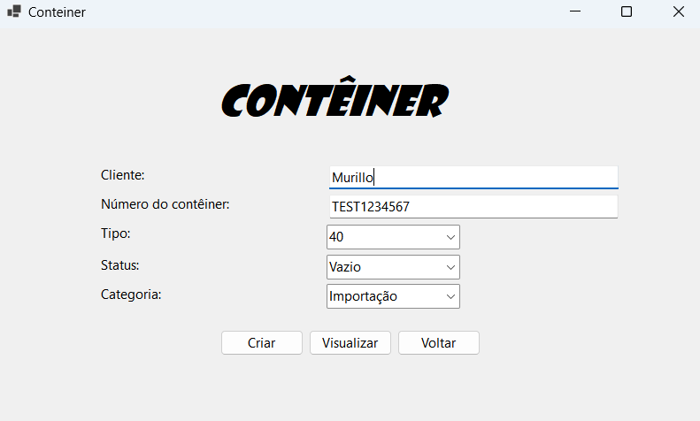
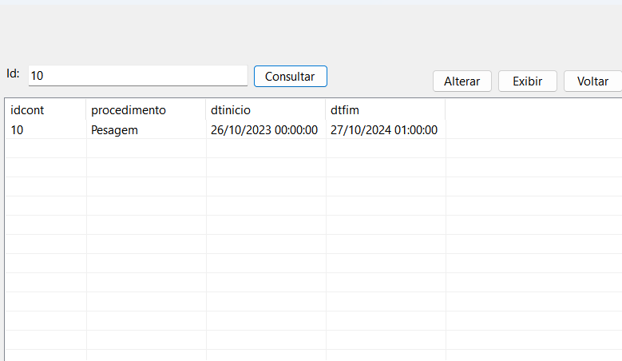

<h1 align=center>
  
 Projeto CRUD Windows Forms - Gerenciando Contêineres com C# e SQL Server💻
</h1>

<h1 align="center">
    
</h1>

<h1 align="center">
    
</h1>

## 🚀Sobre o Projeto:
 Este é o meu projeto pessoal de CRUD, dedicado ao gerenciamento de contêineres e movimentações. Marca o início da minha jornada na programação, onde busco continuamente aprimorar minhas habilidades e conhecimentos.
 
## 🧑‍💻Linguagens Utilizadas:
   **📚C#:** A linguagem principal do projeto.  
   **💽SQL Server:** O banco de dados utilizado para armazenar os dados.

## 🔧Como Utilizar:

  🛠️Clonar o Repositório: Use o comando <code>git clone</code> para baixar o projeto.  
  📝Configuração Rápida: Configure seu ambiente de desenvolvimento.  
  🏗️Execução Simples: Abra o projeto no Visual Studio Community e execute. 

## 🪟Objetivo:
🎯Meu objetivo é desenvolver um CRUD eficiente e de alta qualidade para o gerenciamento de contêineres e movimentações. Este projeto está sempre em evolução, e estou entusiasmado para receber contribuições e sugestões que possam aprimorá-lo ainda mais e proporcionar uma experiência de usuário excepcional.

